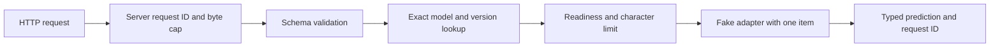

# Architecture

Status: M0 foundation. The final design is specified in
[REQUIREMENTS.md](REQUIREMENTS.md); this page distinguishes current behavior from
the planned scheduler.

## Package structure

| Section | Location | Responsibility |
| --- | --- | --- |
| HTTP API | `src/inference_service/api/` | Body cap, schemas, routes, safe errors, request IDs |
| Core contracts | `src/inference_service/core/` | Text inputs, predictions, immutable model identity and metadata |
| Adapters | `src/inference_service/adapters/` | Typed protocol and deterministic fake implementation |
| Runtime | `src/inference_service/runtime/` | Validated environment configuration and fixed model registry |
| Verification | `tests/` | API boundaries, fake behavior, registry and configuration tests |

Create scheduler, observability, training, benchmark, and artifact-preparation
modules when their milestones implement actual behavior. Empty placeholders do
not establish support.

## Current request flow

The middleware counts received bytes, including chunked requests, and rejects a
body beyond 32 KiB before JSON parsing. This is a per-request parsing bound, not a
global server memory or network admission bound. The character limit defaults to
8,000 Unicode characters and is checked before prediction. Blank input is invalid.

Each request gets a fresh UUID, returned in `X-Request-ID` and prediction/error
envelopes. Client-provided IDs are not adopted. Version lookup has no `latest`
alias, filesystem paths, URLs, or caller-selected adapters.

## Shared contracts

- `TextInput`: validated, immutable input with nonblank text.
- `Prediction` and `SentimentScores`: typed binary result with bounded finite scores.
- `ModelKey`: immutable model ID and version; currently also the compatibility key
  because the API has no prediction options.
- `ModelMetadata`: identity, task, input type, labels, device, and maximum batch size.
- `ModelAdapter`: metadata, load, cheap validation, compatibility key, ordered batch
  prediction, and close. Real adapters must implement one batched forward pass.
- `ModelRegistry`: fixed startup mapping; duplicate identities and empty registries
  fail construction. Different explicit versions can coexist in the contract.

The running application configures only `fake-sentiment/v1`. The generic registry
contract is not a claim of concurrent multi-model execution.

## Fake adapter semantics

The fake splits lowercase text into ASCII letter tokens. It counts occurrences of
`excellent`, `good`, `great`, `love`, `wonderful` against `awful`, `bad`, `hate`,
`poor`, `terrible`. A positive balance gives a positive score of 0.8; a negative
balance gives 0.2; a tie gives 0.5. Negative score is one minus positive score;
ties select the positive label. These are deterministic fixtures, not learned or
calibrated probabilities. Negation and language understanding are not implemented.

Its batch contract permits 1–8 inputs and preserves order. The HTTP path submits
exactly one input. There is no neural network or batched forward pass in M0.

## Lifecycle and readiness

The app factory validates settings and constructs one adapter and one registry.
FastAPI lifespan loads the fake once on startup and closes it on shutdown.
Readiness is true only within that lifespan. Liveness never invokes prediction.

M0 calls the tiny, bounded, in-memory fake synchronously from the handler. This
temporary path must not receive a slow adapter or real model. No dedicated worker,
pending queue, request deadline, disconnect cleanup, watchdog, or bounded draining
policy is implemented yet. Readiness therefore does not yet represent those M1
conditions. Structured application logs and `/metrics` also arrive in M1.

## Planned M1 execution ownership

The event loop will own admission, bounded pending queues, request envelopes,
client futures, deadlines, and terminal transitions. A dedicated executor will
perform preprocessing and inference, with at most one submitted/running batch per
configured adapter. Worker results will return to the event loop to resolve the
correct client futures.

Keep expired/cancelled pending work within capacity accounting until promptly
removed. A running timeout releases its client, not the worker slot. Timed
collection uses the oldest pending arrival; time spent waiting for a busy worker
must not be followed by a fresh collection window.

Before M2, replace the inline fake call with this scheduler and prove the relevant
T01–T11 and T13–T15 acceptance tests. Full M1 request lifecycle guarantees are not
claimed by the M0 tests.
