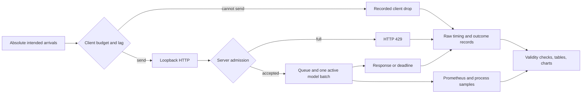

# Architecture

Status: M4 complete, with two real adapters using the shared scheduler. The design is specified in
[REQUIREMENTS.md](REQUIREMENTS.md).

## Package structure

| Section | Location | Responsibility |
| --- | --- | --- |
| HTTP API | `src/inference_service/api/` | Body cap, schemas, routes, safe errors, request IDs |
| Core | `src/inference_service/core/` | Contracts, envelopes, states, scheduler, admission and errors |
| Adapters | `src/inference_service/adapters/` | Typed protocol, fake, pinned Hugging Face, custom network and artifacts |
| Runtime | `src/inference_service/runtime/` | Validated scheduler configuration and fixed model registry |
| Observability | `src/inference_service/observability/` | JSON logs and isolated Prometheus registry |
| Verification | `tests/` | API boundaries, lifecycle, scheduling, overload and failures |
| Training | `training/` | Pinned dataset preparation, CPU training, frozen-export evaluation |
| Preparation | `scripts/` | Explicit Hugging Face snapshot retrieval |
| Experiments | `benchmarks/` | Bounded open-loop driver, local server orchestration, reports and plots |

M4 experiment methods and measured revisions are documented in [BENCHMARKS.md](BENCHMARKS.md).

## Request flow

```mermaid
flowchart LR
    A[HTTP request] --> B[Server request ID, start time and byte cap]
    B --> C[Schema validation]
    C --> D[Exact model and version lookup]
    D --> E[Character limit]
    E --> F[Per-model scheduler admission]
    F --> G[Policy selects compatible batch]
    G --> H[One dedicated execution thread]
    H --> I[Event loop correlates ordered results]
    I --> J[Typed response with request ID]
```

The middleware starts the monotonic deadline at handler entry, counts received
bytes including chunked requests, and rejects a body beyond 32 KiB before JSON
parsing. This is a per-request parsing bound, not a global server memory bound. The
character limit defaults to 8,000 Unicode characters and is checked before admission.

Each request gets a fresh UUID in `X-Request-ID` and prediction/error envelopes.
Client-provided IDs are not adopted. Version lookup has no `latest` alias,
filesystem path, URL, or caller-selected adapter.

## Scheduler and execution ownership

The event loop owns admission, the bounded pending deque, request envelopes,
futures, deadlines, and terminal transitions. Admission checks capacity and appends
under one condition lock. Pending dead entries are reclaimed before capacity checks
and batch formation.

One driver task is the only code allowed to submit to a scheduler's one-thread
executor. It awaits the active call before forming another batch, so the executor
cannot accumulate a hidden backlog. At most `pending_capacity` waiting items plus
one active batch of `max_batch_size` items exist per scheduler.

Single dispatches one item. Immediate dispatches currently available items up to
the limit. Timed dispatches a full batch immediately, or waits until the oldest
item's window expires. Time spent behind an active worker counts toward that window.
A zero timed window behaves like immediate batching.

The worker returns ordered results or an error. The event loop checks result count
and maps each index to its original envelope. The scheduler is model-independent;
adapter validation, preprocessing, forward execution, and result interpretation
remain adapter responsibilities.

## Lifecycle and failure semantics

Accepted states are pending, running, succeeded, failed, expired, and cancelled.
Each envelope reaches a terminal state once. Pending expiry or cancellation removes
the item promptly. Running expiry/cancellation terminates its waiter while native
execution retains the slot; late output is discarded without affecting survivors.

Recoverable batch exceptions fail every live member and leave the scheduler ready.
A wrong output count is an adapter contract failure. An adapter can signal a fatal
worker failure, and a watchdog marks an overlong active call unavailable. Recovery
from either requires process restart.

Shutdown closes admission and readiness, then drains accepted work within existing
deadlines and the grace allowance. Remaining live waiters receive an unavailable
outcome. Python cannot kill a native call in a thread. When grace expires with a
call still active, shutdown abandons it and skips adapter close to avoid racing its
resources; the process supervisor must terminate/restart the process.

FastAPI lifespan loads and closes the adapter through its executor. Readiness
requires open admission, a live driver, and no watchdog/fatal-worker failure. Queue
fullness alone does not change readiness. Liveness never invokes inference.

## Model identity and fake adapter

One server session configures either `fake-sentiment/v1` or
`huggingface-sentiment/hf-sst2-714eb0fa-max256`. Scheduler instances are per
model/version; isolated dual-version tests prove their queues and calls cannot mix.
Concurrent multi-model service is not enabled.

The fake splits lowercase text into ASCII letter tokens and counts a documented
positive/negative word set. It returns fixed scores 0.8, 0.2, or 0.5. These are test
fixtures, not learned or calibrated probabilities. Its batch contract preserves
order for 1–8 inputs. Because there is no neural network, M1 proves batching
mechanics rather than a real batched forward pass.

The Hugging Face adapter validates a locally generated integrity manifest before
loading. It uses the pinned DistilBERT SST-2 safetensors artifact, pads to the longest
item in the current batch, truncates at 256 tokens, creates attention masks, and
runs one PyTorch forward call. See [its adapter card](models/HUGGINGFACE_SST2.md).

The custom adapter loads the local vocabulary, typed tokenizer/architecture config,
and safetensors state after checking an exact file manifest and content-derived
version. Its embedding → masked mean → hidden ReLU → two-class network lives in
`custom_network.py`, shared with offline training. Both adapters implement the same
protocol and phase timings. Integrating the custom adapter changed startup selection,
not scheduler core code. See [the custom model card](models/CUSTOM_SENTIMENT.md).

## Offline custom-model lifecycle

`training.data` validates a pinned UCI archive, deduplicates normalized text before
stratification, and records immutable split files and hashes. `training.train` fits
vocabulary on selected training rows, initializes weights, and chooses a checkpoint
using validation macro-F1. It never opens the test split. `training.evaluate` checks
the frozen export against its dataset provenance and measures the held-out test set.
The evaluation report is added separately from the versioned prediction artifacts.
Each command refuses to overwrite existing experiment output.

Only preparation requires networking. Serving imports PyTorch lazily when a real
adapter is loaded; fake service startup and default tests need no ML dependencies.
Full strict type checking requires the optional extras for their type information.

## Observability

JSON logs contain timestamp, event, request ID where relevant, configured model,
version, policy, outcome, and bounded error category. Raw input text is never logged.

Prometheus metrics label only configured identity, policy, and small decision,
outcome, or failure categories. Metrics cover admission/rejection, terminal states,
pending depth, active batches, actual batch size, request duration, queue wait,
complete adapter-call duration, adapter-reported preprocessing/forward/postprocessing
durations, and failures. Fake phase values are zero; the real adapter records each
phase using the same instrumentation for every policy.

## Experiment boundaries

The driver bounds tasks before creating them; the HTTP connection limit matches
that budget so the connection pool is not an intentional hidden queue. It records
actual send lag and never waits for responses to set the next intended arrival.
Server and client measurements remain separate. A client-invalid run cannot establish
server capacity even when its successful requests appear fast.

The experiment runner uses a separate single-process server for each policy and
waits for a drained server between intervals. Model loading, warmup, and preparation
are excluded from the measured interval. The raw file records client times; metrics
describe internal queue and adapter phases. These are related but different clocks
and definitions, so the report does not equate forward time with end-to-end latency.
