# Architecture

Status: M1 scheduler and bounded lifecycle. The final design remains specified in
[REQUIREMENTS.md](REQUIREMENTS.md).

## Package structure

| Section | Location | Responsibility |
| --- | --- | --- |
| HTTP API | `src/inference_service/api/` | Body cap, schemas, routes, safe errors, request IDs |
| Core | `src/inference_service/core/` | Contracts, envelopes, states, scheduler, admission and errors |
| Adapters | `src/inference_service/adapters/` | Typed protocol and deterministic fake implementation |
| Runtime | `src/inference_service/runtime/` | Validated scheduler configuration and fixed model registry |
| Observability | `src/inference_service/observability/` | JSON logs and isolated Prometheus registry |
| Verification | `tests/` | API boundaries, lifecycle, scheduling, overload and failures |

Training, benchmark, and artifact-preparation modules arrive when their milestones
implement real behavior. Empty placeholders do not establish support.

## Request flow

```mermaid
flowchart LR
    A[HTTP request] --> B[Server request ID, start time and byte cap]
    B --> C[Schema validation]
    C --> D[Exact model and version lookup]
    D --> E[Character limit]
    E --> F[Per-model scheduler admission]
    F --> G[Policy selects compatible batch]
    G --> H[One dedicated execution thread]
    H --> I[Event loop correlates ordered results]
    I --> J[Typed response with request ID]
```

The middleware starts the monotonic deadline at handler entry, counts received
bytes including chunked requests, and rejects a body beyond 32 KiB before JSON
parsing. This is a per-request parsing bound, not a global server memory bound. The
character limit defaults to 8,000 Unicode characters and is checked before admission.

Each request gets a fresh UUID in `X-Request-ID` and prediction/error envelopes.
Client-provided IDs are not adopted. Version lookup has no `latest` alias,
filesystem path, URL, or caller-selected adapter.

## Scheduler and execution ownership

The event loop owns admission, the bounded pending deque, request envelopes,
futures, deadlines, and terminal transitions. Admission checks capacity and appends
under one condition lock. Pending dead entries are reclaimed before capacity checks
and batch formation.

One driver task is the only code allowed to submit to a scheduler's one-thread
executor. It awaits the active call before forming another batch, so the executor
cannot accumulate a hidden backlog. At most `pending_capacity` waiting items plus
one active batch of `max_batch_size` items exist per scheduler.

Single dispatches one item. Immediate dispatches currently available items up to
the limit. Timed dispatches a full batch immediately, or waits until the oldest
item's window expires. Time spent behind an active worker counts toward that window.
A zero timed window behaves like immediate batching.

The worker returns ordered results or an error. The event loop checks result count
and maps each index to its original envelope. The scheduler is model-independent;
adapter validation, preprocessing, forward execution, and result interpretation
remain adapter responsibilities.

## Lifecycle and failure semantics

Accepted states are pending, running, succeeded, failed, expired, and cancelled.
Each envelope reaches a terminal state once. Pending expiry or cancellation removes
the item promptly. Running expiry/cancellation terminates its waiter while native
execution retains the slot; late output is discarded without affecting survivors.

Recoverable batch exceptions fail every live member and leave the scheduler ready.
A wrong output count is an adapter contract failure. An adapter can signal a fatal
worker failure, and a watchdog marks an overlong active call unavailable. Recovery
from either requires process restart.

Shutdown closes admission and readiness, then drains accepted work within existing
deadlines and the grace allowance. Remaining live waiters receive an unavailable
outcome. Python cannot kill a native call in a thread. When grace expires with a
call still active, shutdown abandons it and skips adapter close to avoid racing its
resources; the process supervisor must terminate/restart the process.

FastAPI lifespan loads and closes the adapter through its executor. Readiness
requires open admission, a live driver, and no watchdog/fatal-worker failure. Queue
fullness alone does not change readiness. Liveness never invokes inference.

## Model identity and fake adapter

The running application configures only `fake-sentiment/v1`. Scheduler instances
are per model/version; isolated dual-version tests prove their queues and calls
cannot mix. Concurrent multi-model service is not enabled yet.

The fake splits lowercase text into ASCII letter tokens and counts a documented
positive/negative word set. It returns fixed scores 0.8, 0.2, or 0.5. These are test
fixtures, not learned or calibrated probabilities. Its batch contract preserves
order for 1–8 inputs. Because there is no neural network, M1 proves batching
mechanics rather than a real batched forward pass.

## Observability

JSON logs contain timestamp, event, request ID where relevant, configured model,
version, policy, outcome, and bounded error category. Raw input text is never logged.

Prometheus metrics label only configured identity, policy, and small decision,
outcome, or failure categories. Metrics cover admission/rejection, terminal states,
pending depth, active batches, actual batch size, request duration, queue wait,
execution duration, and failures. Preprocessing and postprocessing metric families
exist but have no samples until real adapters provide separate phase timings in M2.
